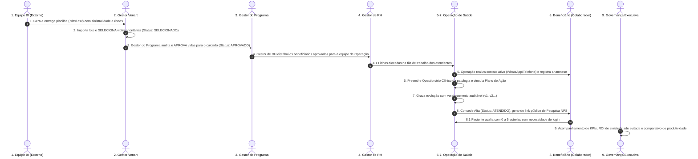
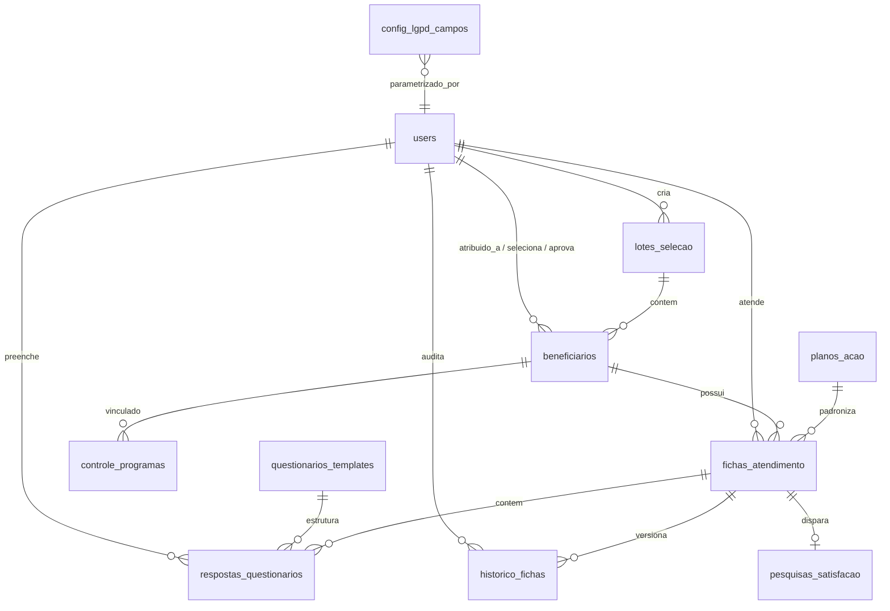

# Documento de Requisitos de Produto (PRD)

## Meu Concierge de Saúde — Sistema de Acompanhamento de Saúde

> **Status do Documento:** Aprovado / Versão Oficial  
> **Versão do Produto:** v0.0.8  
> **Data da Última Atualização:** Setembro de 2026  
> **Autor / Time Responsável:** Squad de Engenharia e Saúde Corporativa Venart  
> **Público-Alvo:** Gestores Venart, Médicos Gestores de Programa, Gestores de RH Corporativo, Operação Clínica e Equipe de Engenharia / Produto

---

## 1. Visão Geral

### 1.1 Descrição do Produto

O **Meu Concierge de Saúde** (marca de aplicação: _CareTrack Saúde_) é uma plataforma corporativa integrada de governança clínica, triagem preditiva e concierge de acompanhamento contínuo da saúde de beneficiários titulares e dependentes vinculados a planos de saúde corporativos.

O sistema orquestra ponta a ponta o ciclo de cuidado em saúde populacional:

1. **Mineração e Ingestão de Dados:** Carga de sinistralidade de 12 meses e elegibilidade processada externamente pelo time de Business Intelligence (BI);
2. **Triagem Populacional:** O **Gestor Venart** importa lotes e seleciona beneficiários com base em critérios de corte de custo e risco;
3. **Aprovação Clínica:** O **Gestor do Programa** audita e aprova as vidas prioritárias para as linhas de cuidado;
4. **Distribuição Operacional:** O **Gestor de RH** distribui os beneficiários aprovados para a equipe assistencial sem viés discriminatório;
5. **Cuidado Proativo & Questionários Clínicos:** A equipe de **Operação** realiza contatos ativos (WhatsApp/telefone), aplica questionários clínicos padronizados por patologia, vincula planos de ação estruturados, registra evoluções com histórico de auditoria e concede alta clínica;
6. **Desfecho & Satisfação (NPS):** Disparo automático de pesquisas de satisfação sem login para os pacientes e consolidação em tempo real de KPIs de resolutividade, sinistralidade evitada e comparativo de produtividade.

### 1.2 Problema que Resolve

- **Sinistralidade Médica Descontrolada e Reativa:** Empresas contratantes sofrem com reajustes anuais severos nos prêmios de planos de saúde pela ausência de gestão ativa de portadores de doenças crônicas ou casos de alto custo.
- **Vulnerabilidade Regulatória e LGPD Dinâmica:** A necessidade de equilibrar a privacidade dos colaboradores (Lei nº 13.709/2018 - LGPD) com a necessidade operacional da equipe de saúde. No modelo do Concierge de Saúde (v0.0.8), a proteção recai estritamente sobre a identificação nominal do indivíduo (`nome`), enquanto dados epidemiológicos e assistenciais (`condicao_principal`, `risco` e `custo_12m`) permanecem visíveis para direcionamento efetivo, tudo parametrizável dinamicamente via coleção `config_lgpd_campos`.
- **Falta de Padronização na Abordagem Clínica:** Acompanhamentos dispersos e subjetivos. O sistema introduz **Templates de Questionários Clínicos Parametrizáveis** com exclusividade de governança pela Venart (`GESTOR_VENART`), garantindo protocolos homogêneos para cada condição clínica.
- **Invisibilidade de Desfecho e ROI:** Dificuldade histórica de demonstrar o impacto financeiro da medicina preventiva e a satisfação real dos colaboradores acolhidos.

### 1.3 Objetivo Principal

Prover um ecossistema digital corporativo auditável, em estrita conformidade com a LGPD, que permita estratificar ativamente a população segurada, protocolar o acompanhamento com questionários clínicos especializados, estabilizar pacientes crônicos, reduzir custos assistenciais evitáveis e mensurar a resolutividade operacional com elevado índice de satisfação do paciente.

### 1.4 Proposta de Valor

- **Para o Gestor Venart (`GESTOR_VENART`):** Governança irrestrita da plataforma, auditoria global de sinistralidade, importação de lotes, cadastro de usuários, gestão e parametrização exclusiva de Questionários Clínicos e visualização estratégica de ROI.
- **Para o Gestor do Programa (`GESTOR_PROGRAMA`):** Validação técnica das vidas selecionadas, aprovação clínica para ingresso nos programas de saúde, catálogo de planos de ação e análise comparativa de indicadores médicos.
- **Para o Gestor de RH (`GESTOR_RH`):** Distribuição equilibrada e célere das vidas aprovadas aos operadores de saúde, monitoramento da volumetria populacional por unidade e acompanhamento de adesão com segurança jurídica e proteção da identidade do titular.
- **Para a Operação Assistencial (`OPERACAO`):** Fila de pacientes dedicada, ficha clínica estruturada, questionários clínicos dinâmicos por patologia com validação de respostas, autopreenchimento de metas via planos de ação e fluxo ágil de alta com geração de link de avaliação.
- **Para o Beneficiário (Colaborador / Dependente):** Acolhimento humano e proativo de saúde ("concierge"), orientações preventivas personalizadas e canal público e simples para avaliação do atendimento com nota de 0 a 5 estrelas.

---

## 2. Contexto e Oportunidade

### 2.1 Cenário de Segurados com Plano de Saúde

No mercado de saúde suplementar corporativo, a regra de Pareto se aplica de forma intensa: aproximadamente **80% dos custos assistenciais totais** originam-se em uma faixa de **10% a 15% da população segurada**. Esse grupo concentra portadores de doenças crônicas (como Diabetes, Hipertensão, DPOC, Insuficiência Cardíaca), gestantes de alto risco, casos ortopédicos crônicos (Lombalgia) e transtornos de saúde mental com frequência elevada de pronto-socorro.

A atuação focada do Concierge de Saúde visa estabilizar esses quadros clínicos através de monitoramento periódico, adesão medicamentosa e orientações de estilo de vida, evitando descompensações agudas que culminem em internações em UTI ou procedimentos de urgência de altíssimo custo.

### 2.2 O Ciclo de Cuidado Completo na v0.0.8

O fluxo contínuo de cuidado é estruturado na seguinte cadeia de valor:

```
[Mineração de Sinistralidade (BI Externo)]
                    ↓
[Importação de Lotes & Seleção Populacional (GESTOR_VENART)]
                    ↓
[Auditoria Clínica & Aprovação de Vidas (GESTOR_PROGRAMA)]
                    ↓
[Distribuição Logística aos Operadores (GESTOR_RH)]
                    ↓
[Contato Ativo, Questionário Clínico & Plano de Cuidado (OPERACAO)]
                    ↓
[Desfecho Clínico (Alta), Pesquisa NPS Sem Login & Analytics Executivo]
```

---

## 3. Matriz de Perfis de Acesso (RBAC — Perfis de Acesso)

A arquitetura de controle de acesso conta com perfis especializados, com governança reforçada a partir da versão **v0.0.21**:

| Perfil RBAC               | Código do Perfil  | Escopo de Atuação                   | Permissões Principais                                                                                                                                                                                                                                                                                   |
| :------------------------ | :---------------- | :---------------------------------- | :------------------------------------------------------------------------------------------------------------------------------------------------------------------------------------------------------------------------------------------------------------------------------------------------------ |
| **0. Super Usuário**      | `SUPERUSUARIO`    | Administração de Acessos & Logins   | **Exclusividade absoluta na criação, edição de logins/senhas e ativação de novos usuários** no app (`/gestor/usuarios`). Possui acesso de supervisão e auditoria global aos módulos administrativos.                                                                                                    |
| **1. Gestor Venart**      | `GESTOR_VENART`   | Governança Global do Sistema        | Importação de lotes (`.xlsx`/`.csv`), seleção populacional, **gestão e parametrização exclusiva de questionários clínicos (CRUD de templates)**, planos de ação, controle de programas, relatórios de auditoria e visão global financeira. _(Opção de cadastro de usuários restrita ao Super Usuário)_. |
| **2. Gestor do Programa** | `GESTOR_PROGRAMA` | Governança Clínica e Médica         | Análise clínica das vidas selecionadas, **aprovação de vidas para os programas (`APROVADO`)**, visualização do catálogo de planos, controle de programas e relatórios comparativos médicos.                                                                                                             |
| **3. Gestor de RH**       | `GESTOR_RH`       | Gestão e Distribuição Populacional  | Visualização das vidas no status `APROVADO`, **distribuição balanceada para a equipe de Operação** por unidade/região, relatórios agregados de distribuição populacional.                                                                                                                               |
| **4. Operação**           | `OPERACAO`        | Execução Assistencial e Atendimento | Visualização da fila de pacientes sob sua responsabilidade, abertura e edição de Fichas de Atendimento, **preenchimento de Questionários Clínicos por patologia**, vínculo a planos de ação, versionamento de prontuário, concessão de Alta Clínica e disparo de link de satisfação.                    |

> _Regra de Negócio Mandatória (v0.0.21):_ **Somente o `SUPERUSUARIO` pode criar novos logins, senhas e gerenciar contas de usuários.** O acesso à rota `/gestor/usuarios` e o item no menu lateral foram removidos do perfil `GESTOR_VENART` e de todos os demais usuários, garantindo segregação total de governança.

> _Nota de Retrocompatibilidade:_ Usuários legados cadastrados com os perfis anteriores são automaticamente mapeados pelo sistema (`GESTOR` → `GESTOR_VENART`; `RH` → `GESTOR_RH`; `ATENDENTE` → `OPERACAO`).

---

## 4. Política de Privacidade e LGPD Dinâmica (v0.0.8)

### 4.1 Princípio de Proteção Mínima Necessária

Conforme diretriz aprovada para o produto:

> **"De acordo com a LGPD, a única proteção mandante é o NOME do paciente/beneficiário. Os dados de condição clínica principal, classificação de risco e custo acumulado em 12 meses são operacionais e visíveis para todos os perfis, viabilizando o direcionamento assistencial correto."**

Quando o campo `nome` está protegido para um perfil:

- O nome do paciente é substituído dinamicamente pela máscara: **`Beneficiário Protegido (MAT-XXXXXX)`**, onde `MAT-XXXXXX` é a matrícula funcional do indivíduo.
- Os campos `condicao_principal`, `risco` e `custo_12m` permanecem visíveis para análise técnica e operacional.

### 4.2 Coleção `config_lgpd_campos`

A parametrização de visibilidade é dinâmica e reside na coleção `config_lgpd_campos` do PocketBase, auditável e editável pelo Gestor Venart. Cada registro define:

- `perfil`: `GESTOR_VENART` | `GESTOR_PROGRAMA` | `GESTOR_RH` | `OPERACAO`
- `campo`: `nome` | `condicao_principal` | `risco` | `custo_12m`
- `visivel`: booleano (`true` ou `false`)
- `atualizado_por`: ID do usuário responsável pela alteração
- `atualizado_em`: Timestamp ISO 8601 da atualização

### 4.3 Matriz Padrão de Visibilidade LGPD (v0.0.8)

| Campo de Dados                  |   `GESTOR_VENART`    |  `GESTOR_PROGRAMA`   |     `GESTOR_RH`      |      `OPERACAO`      | Formato Exibido                      |
| :------------------------------ | :------------------: | :------------------: | :------------------: | :------------------: | :----------------------------------- |
| **Matrícula Funcional**         |       Visível        |       Visível        |       Visível        |       Visível        | Formato original (`MAT-XXXX`)        |
| **Nome do Beneficiário**        | **Protegido (LGPD)** | **Protegido (LGPD)** | **Protegido (LGPD)** | **Protegido (LGPD)** | `Beneficiário Protegido (MAT-XXXX)`  |
| **Condição Clínica Principal**  |       Visível        |       Visível        |       Visível        |       Visível        | Diagnóstico clínico real             |
| **Classificação de Risco**      |       Visível        |       Visível        |       Visível        |       Visível        | `BAIXO`, `MEDIO`, `ALTO`, `CRITICO`  |
| **Custo Assistencial 12m**      |       Visível        |       Visível        |       Visível        |       Visível        | Valor numérico formatado em BRL (R$) |
| **Unidade / Região**            |       Visível        |       Visível        |       Visível        |       Visível        | Texto da unidade fabril/corporativa  |
| **Contatos (Telefone/Celular)** |       Visível        |       Visível        |       Visível        |       Visível        | Utilizado para contato operacional   |

_Observação:_ Caso a gestão deseje flexibilizar ou restringir a visualização de qualquer campo para qualquer perfil, a alteração é feita diretamente em `config_lgpd_campos`, refletindo instantaneamente no cache frontend (`fetchLgpdConfig`).

---

## 5. Gestão de Questionários Clínicos (Exclusivo GESTOR_VENART)

### 5.1 Propósito dos Questionários

Garantir que a equipe de **Operação** realize anamneses e monitoramentos padronizados de acordo com a patologia de base do beneficiário. Ao abrir uma ficha clínica, o sistema detecta a condição clínica do paciente (ex: _Diabetes Mellitus_) e carrega automaticamente o template correspondente.

### 5.2 Estrutura e Governança

- **Permissão de Gestão:** CRUD exclusivo do perfil `GESTOR_VENART` em `/gestor/questionarios`. Usuários com outros perfis visualizam mensagem de restrição de acesso.
- **Tipos de Questões Suportadas:**
  1. `texto_livre`: Respostas descritivas, valores numéricos ou datas (com placeholder informativo);
  2. `escala`: Escala numérica graduada de 0 a 5 com legendas configuráveis para os extremos (ex: `0 = Muito Ruim` a `5 = Excelente`);
  3. `sim_nao`: Escolha dicotômica objetiva;
  4. `multipla_escolha`: Lista com 2 ou mais opções pré-definidas para seleção única.
- **Obrigatoriedade:** Cada questão possui um flag `obrigatoria` para orientar o preenchimento da Operação.
- **Reordenação Dinâmica:** Interface intuitiva com botões para mover questões para cima/baixo.
- **Duplicação de Protocolos:** Permite clonar templates existentes para rápida parametrização de variações clínicas.
- **Exclusão Inteligente (Soft Delete Protetivo):**
  - Se o template **não possuir** respostas salvas em fichas, é feita a exclusão física do registro.
  - Se o template **já possuir** respostas vinculadas no histórico de atendimentos, o sistema aplica automaticamente **Soft Delete (`ativo = false`)**, preservando a integridade referencial dos prontuários históricos.

### 5.3 Os 10 Templates Clínicos Seeded na Plataforma

A base inicial conta com 10 templates pré-configurados e ativos, correspondendo às principais patologias de acompanhamento:

1. **Diabetes Mellitus:** Avaliação de Hemoglobina Glicada recente, episódios de hipoglicemia, adesão à insulina/antidiabéticos orais, automonitorização glicêmica, exame dos pés e hábitos alimentares.
2. **Hipertensão Arterial:** Média pressórica dos últimos 7 dias, sintomas de pico hipertensivo (cefaleia nucal, escotomas), adesão farmacológica, restrição de sódio e presença de aparelho domiciliar.
3. **Lombalgia Crônica:** Escala Visual Analógica de dor (EVA 0-5), irradiação para membros inferiores (ciatalgia), impacto laboral, fisioterapia/fortalecimento e pausas ergonômicas.
4. **Insuficiência Cardíaca:** Ganho súbito de peso (edema periférico), ortopneia (travesseiros para dormir), classe funcional NYHA (I a IV), adesão a diuréticos/betabloqueadores e restrição hídrica.
5. **Asma Brônquica:** Limitação de atividades cotidianas (ACT), despertares noturnos por chiado/tosse, frequência de uso de bombinha de resgate, corticoide de manutenção e gatilhos ambientais.
6. **Obesidade Grau II:** Evolução ponderal nos últimos 30 dias, frequência de atividade física aeróbica moderada/vigorosa, adesão ao plano nutricional, sintomas de apneia do sono e compulsão alimentar.
7. **Gestação de Alto Risco:** Idade gestacional e DPP, sinais de alerta obstétrico (sangramento/perda líquida), sintomas de pré-eclâmpsia, mobilograma fetal diário e pré-natal de alto risco com Doppler.
8. **Transtorno de Ansiedade:** Nível de tensão (GAD-7 simplificada), episódios de crise de pânico, qualidade do sono/insônia, adesão à psicoterapia e psicofármacos contínuos.
9. **Dislipidemia:** Perfil lipídico recente (LDL/Triglicérides), adesão a estatinas/ezetimiba, rastreamento de mialgia, controle de gorduras saturadas e histórico familiar precoce de IAM/AVC.
10. **DPOC:** Escala de dispneia mMRC (0 a 4), histórico de tabagismo atual, exacerbações nos últimos 6 meses, uso correto de broncodilatadores inalatórios (LAMA/LABA) e vacinação.

- **Fallback Clínico Geral:** Caso o paciente possua uma patologia atípica sem template específico cadastrado, o sistema disponibiliza o _Questionário Clínico Geral_ contendo avaliação de saúde subjetiva, novos sintomas, adesão medicamentosa e frequência de exames.

---

## 6. Fluxo de Status do Beneficiário (v0.0.8)

A máquina de estados dos beneficiários opera em 5 status oficiais:

```
[ELEGIVEL] ──(1) Selecionar──> [SELECIONADO] ──(2) Aprovar──> [APROVADO] ──(3) Conceder Alta──> [ATENDIDO]
    │                                                                                                  ▲
    └──────────────────────(Em caso de exclusão lógica) ──> [INATIVO] <────────────────────────────────┘
```

1. **`ELEGIVEL`:** Beneficiário recém-carregado no sistema através de importação de planilha (`.xlsx`/`.csv`) ou cadastro manual. Encontra-se na base aguardando triagem.
2. **`SELECIONADO`:** O **Gestor Venart** aplicou filtros de risco e custo na tela de seleção e marcou a vida como elegível para ingresso nos programas de saúde.
3. **`APROVADO`:** O **Gestor do Programa** auditou a indicação médica e aprovou a inclusão no programa. Vidas neste status ficam disponíveis para distribuição pelo Gestor de RH e atendimento pela Operação.
4. **`ATENDIDO`:** O profissional de **Operação** realizou os contatos, aplicou o questionário clínico, acompanhou a evolução e concluiu o ciclo assistencial concedendo **Alta Clínica**, acionando o envio da pesquisa de satisfação.
5. **`INATIVO`:** Beneficiário desativado logicamente via _soft delete_ (`ativo = false`), preservando todo o histórico prévio.

---

## 7. Fluxo Operacional Detalhado em 9 Etapas



### Detalhamento das Etapas:

1. **Etapa 1 — Mineração e Ingestão de Dados pelo BI:** Extração externa de sinistralidade médica acumulada em 12 meses e internações. A planilha é formatada com matrícula, diagnóstico principal, faixa etária e custos. _(O BI não acessa a plataforma diretamente)_.
2. **Etapa 2 — Importação e Seleção pelo Gestor Venart:** O Gestor Venart faz upload em `/gestor/importar`, valida os totalizadores de custo e processa o lote (`lotes_selecao`). Em `/gestor/selecionar`, filtra por risco e custo, selecionando as vidas (`status = 'SELECIONADO'`).
3. **Etapa 3 — Aprovação Clínica pelo Gestor do Programa:** O Gestor do Programa valida a pertinência médica das vidas selecionadas e confirma a aprovação (`status = 'APROVADO'`).
4. **Etapa 4 — Distribuição Operacional pelo Gestor de RH:** O Gestor de RH avalia a distribuição geográfica (São Paulo, Curitiba, Rio de Janeiro, etc.) e a carga dos atendentes em `/rh/distribuir`, atribuindo as vidas aos profissionais de Operação ativos.
5. **Etapa 5 — Contato Ativo e Abertura de Ficha:** O operador acessa `/atendente/fichas`, identifica os pacientes atribuídos e realiza o contato ativo via canal pactuado (WhatsApp corporativo ou telefone), registrando o meio e o desfecho do contato.
6. **Etapa 6 — Aplicação do Questionário Clínico e Plano de Ação:** O operador abre a aba "Questionário Clínico", que carrega dinamicamente o protocolo da condição do paciente (ex: Asma, Hipertensão). Responde às perguntas-chave e associa metas a partir do catálogo de planos de ação.
7. **Etapa 7 — Evolução Auditável e Versionamento:** Ao salvar os apontamentos, o sistema incrementa a versão da ficha (`versao = versao + 1`) e armazena o snapshot anterior em `historico_fichas` com identificação do operador, data e hora.
8. **Etapa 8 — Concessão de Alta e Pesquisa de Satisfação Sem Login:** Finalizado o ciclo terapêutico, o operador aciona "Conceder Alta". O status do beneficiário evolui para `ATENDIDO`. Um token alfanumérico seguro é gerado em `pesquisas_satisfacao`, disponibilizando a URL pública `/pesquisa/:token`. O paciente acessa em qualquer dispositivo móvel e avalia o atendimento com nota de 0 a 5 estrelas e comentário livre, sem necessidade de senha. A nota sincroniza no prontuário.
9. **Etapa 9 — Analytics Executivo, Produtividade e ROI:** A governança acompanha em tempo real o Dashboard Executivo, o volume de casos em cuidado ativo, a taxa de resolutividade por operador, o NPS médio e a economia financeira acumulada estimada sobre os custos de sinistralidade.

---

## 8. Requisitos Funcionais do Sistema (RF)

### 8.1 Módulo Gestor Venart (`GESTOR_VENART`)

- **RF-GV-01 (Importação de Lotes):** Upload e parseamento de planilhas `.xlsx`, `.xls` e `.csv`, com pré-visualização tabular, conferência de somatório de custos e criação do lote em `lotes_selecao`.
- **RF-GV-02 (Seleção Populacional):** Interface de triagem com filtros por risco, custo mínimo/máximo, unidade e diagnóstico, com marcação individual ou em lote para transição para `SELECIONADO`.
- **RF-GV-03 (CRUD de Beneficiários):** Cadastro, edição e desativação lógica de beneficiários, com visualização de dados cadastrais, clínicos e custos assistenciais de 12 meses.
- **RF-SU-01 (Gestão Exclusiva de Usuários RBAC — Exclusivo SUPERUSUARIO):** Exclusividade na criação, edição de logins e senhas, e inativação de contas com atribuição de perfis (`SUPERUSUARIO`, `GESTOR_VENART`, `GESTOR_PROGRAMA`, `GESTOR_RH`, `OPERACAO`), registro de classe (CRM/COREN) e tema de preferência (LIGHT/DARK). Removida dos demais perfis a opção e rota de cadastro de usuários.
- **RF-GV-05 (Parametrização de Questionários Clínicos — Exclusivo):** CRUD completo de templates em `questionarios_templates`, suporte a 4 tipos de resposta, validação de enunciados duplicados, reordenação de perguntas, duplicação e soft delete inteligente quando há respostas vinculadas.
- **RF-GV-06 (Catálogo de Planos de Ação):** Manutenção de protocolos padronizados de cuidado contendo necessidade, objetivo, ação clínica, prazo em dias e prioridade.
- **RF-GV-07 (Controle de Programas):** Gestão de linhas de cuidado crônico vinculadas aos beneficiários e responsáveis clínicos.
- **RF-GV-08 (Dashboards e Relatórios):** Visualização de gráficos de risco, distribuição geográfica, funil de status, custo total assistencial, comparativo de produtividade dos operadores e exportação em CSV com separador `;`.
- **RF-GV-09 (Download do PRD):** Disponibilização de link e botão direto para download do documento oficial de requisitos de produto (`/PRD.md`) no menu lateral e painel do gestor.

### 8.2 Módulo Gestor do Programa (`GESTOR_PROGRAMA`)

- **RF-GP-01 (Aprovação de Vidas):** Painel para auditar os beneficiários no status `SELECIONADO` e confirmar sua inclusão no cuidado, promovendo-os para `APROVADO`.
- **RF-GP-02 (Acompanhamento Clínico):** Acesso às fichas de atendimento, histórico de evoluções, respostas de questionários clínicos e catálogo de planos de ação.
- **RF-GP-03 (Indicadores Comparativos Médicos):** Visualização de taxas de desfecho clínico, distribuição de patologias e tempo médio de permanência nos programas.

### 8.3 Módulo Gestor de RH (`GESTOR_RH`)

- **RF-GR-01 (Distribuição de Vidas Aprovadas):** Painel `/rh/distribuir` para selecionar beneficiários com status `APROVADO` e atribuí-los a profissionais de Operação ativos.
- **RF-GR-02 (Gestão Demográfica e Balanceamento):** Filtros por unidade regional e indicador de carga de trabalho atual por atendente para evitar sobrecarga assistencial.
- **RF-GR-03 (Métricas Populacionais):** Acompanhamento do funil de status e volumetria de vidas sem exposição nominal indevida.

### 8.4 Módulo Operação (`OPERACAO`)

- **RF-OP-01 (Fila de Atendimento Dedicada):** Listagem dos beneficiários atribuídos ao operador com busca textual, ordenação por risco e status da ficha.
- **RF-OP-02 (Ficha de Atendimento Clínico):** Registro detalhado de meio de contato (WhatsApp, Telefone, E-mail, SMS), status do contato (Atendido, Ocupado, Sem Resposta), data do próximo retorno e observações.
- **RF-OP-03 (Preenchimento de Questionários Clínicos):** Abas dedicadas na ficha que exibem o questionário correspondente à patologia do paciente, com validação de campos obrigatórios, salvamento atômico em `respostas_questionarios` e visualização de respostas anteriores.
- **RF-OP-04 (Associação a Planos de Ação):** Seleção de planos de cuidado pré-cadastrados com autopreenchimento imediato de metas e prazos.
- **RF-OP-05 (Versionamento e Trilha de Auditoria):** Incremento automático do campo `versao` da ficha a cada atualização, gravando snapshot em `historico_fichas`.
- **RF-OP-06 (Concessão de Alta e Disparo de Pesquisa):** Finalização com desfecho `ALTA`, alteração do status do paciente para `ATENDIDO`, geração instantânea de token público e botão para cópia do link da pesquisa NPS.
- **RF-OP-07 (Painel Individual do Operador):** Métricas de desempenho próprio (total de fichas, casos concluídos, nota média de satisfação e taxa de resolutividade).

### 8.5 Módulo Público de Pesquisa de Satisfação

- **RF-PU-01 (Acesso via Token Temporário):** Rota pública `/pesquisa/:token` que valida a unicidade do token sem requerer login ou senha.
- **RF-PU-02 (Avaliação Interativa por Estrelas):** Componente de 0 a 5 estrelas com feedback semântico (Excelente a Insatisfatório) e campo de texto livre opcional.
- **RF-PU-03 (Encerramento do Token e Bloqueio de Reenvio):** Após o envio, a pesquisa é marcada como `RESPONDIDO` com gravação do timestamp e bloqueio de novos envios no mesmo token.
- **RF-PU-04 (Sincronização com Prontuário):** A nota atribuída é gravada automaticamente no campo `feedback` da ficha de atendimento e consolida o cálculo do NPS geral.

---

## 9. Requisitos Não Funcionais (RNF)

- **RNF-01 (Performance & Latência):**
  - O carregamento da listagem paginada de beneficiários e questionários não deve exceder **1.2 segundos** sob conexão estável de banda larga.
  - O processamento e renderização dos gráficos Recharts nos painéis executivos deve ocorrer em menos de **300ms** pós-carregamento dos dados.
- **RNF-02 (Segurança da Informação & Criptografia):**
  - Todas as comunicações entre frontend e backend trafegam compulsoriamente via HTTPS / TLS 1.3.
  - Sessão e autenticação geridas por tokens JWT com renovação automática pelo cliente do PocketBase.
  - Sanitização de inputs contra cross-site scripting (XSS) e injeção de parâmetros maliciosos.
- **RNF-03 (Privacidade de Dados & LGPD Dinâmica):**
  - Aplicação estrita da política de privacidade: proteção nominal via máscara `Beneficiário Protegido (MAT-XXXXXX)`.
  - Cache de configurações de privacidade gerenciado via singleton reativo com fallback seguro.
  - Registro rigoroso de autoria e carimbo temporal em todas as mutações clínicas (`historico_fichas` e `config_lgpd_campos`).
- **RNF-04 (Integridade Referencial & Soft Delete):**
  - Remoção lógica (`ativo = false`) em usuários, beneficiários e questionários clínicos utilizados, impedindo quebra de histórico ou perda de rastreabilidade regulatória.
- **RNF-05 (Usabilidade, Acessibilidade e Responsividade):**
  - Interface desenvolvida sobre a biblioteca **shadcn/ui** e utilitários **TailwindCSS**, garantindo coerência visual e usabilidade ergonômica.
  - Suporte completo a alternância de temas Claro (`LIGHT`) e Escuro (`DARK`), persistida no perfil do usuário no banco.
  - Design totalmente responsivo em desktops (1366x768 e 1920x1080), tablets e smartphones para o módulo público de pesquisa.

---

## 10. Modelo de Dados Atualizado (v0.0.8)

O banco de dados PocketBase é composto por **12 coleções integradas**:



### 10.1 Descrição das Coleções

1. **`users` (Usuários e Operadores):**
   - `id`, `name`, `email`, `perfil` (`GESTOR_VENART`, `GESTOR_PROGRAMA`, `GESTOR_RH`, `OPERACAO`), `tema_preferido` (`LIGHT`, `DARK`), `categoria_profissional` (`ENFERMEIRO`, `MEDICO`, `ADMINISTRATIVO`), `registro_profissional` (CRM/COREN), `unidade_regiao`, `ativo` (bool).
2. **`config_lgpd_campos` (Configuração Dinâmica de Privacidade):**
   - `id`, `perfil` (`GESTOR_VENART`, `GESTOR_PROGRAMA`, `GESTOR_RH`, `OPERACAO`), `campo` (`nome`, `condicao_principal`, `risco`, `custo_12m`), `visivel` (bool), `atualizado_por` (relation `users`), `atualizado_em` (date).
3. **`questionarios_templates` (Modelos de Protocolos Clínicos):**
   - `id`, `condicao_principal` (text), `titulo` (text), `descricao` (text), `ativo` (bool), `questoes` (json: array de objetos com `id`, `enunciado`, `tipo`, `obrigatoria`, `opcoes`, `escalaMin`, `escalaMax`, `legendaMin`, `legendaMax`, `placeholder`).
4. **`respostas_questionarios` (Respostas Clínicas Vinculadas a Fichas):**
   - `id`, `ficha_id` (relation `fichas_atendimento`), `template_id` (relation `questionarios_templates`), `respostas` (json: mapa id_questao → resposta), `preenchido_por` (relation `users`), `data_preenchimento` (date).
5. **`beneficiarios` (Vidas da População Segurada):**
   - `id`, `id_externo`, `nome` / `nome_beneficiario`, `matricula`, `unidade` / `unidade_regiao`, `tipo_vinculo` (`TITULAR`, `DEPENDENTE`), `titular_id` (relation `beneficiarios`), `faixa_etaria`, `telefone`, `celular`, `email`, `permite_contato_whatsapp_sms` (bool), `status` (`ELEGIVEL`, `SELECIONADO`, `APROVADO`, `ATENDIDO`, `INATIVO`), `data_selecao`, `data_aprovacao`, `data_distribuicao`, `condicao_principal`, `risco` (`BAIXO`, `MEDIO`, `ALTO`, `CRITICO`), `custo_12m` / `custo_12_meses`, `lote_id` (relation `lotes_selecao`), `selecionado_por` (relation `users`), `aprovado_por` (relation `users`), `atendente_id` (relation `users`), `ativo` (bool).
6. **`lotes_selecao` (Lotes de Importação de Sinistralidade):**
   - `id`, `lote_id`, `data_selecao`, `status` (`IMPORTADO`, `PROCESSADO`, `ERRO`), `total_beneficiarios`, `custo_total`, `criado_por` (relation `users`).
7. **`planos_acao` (Catálogo de Protocolos de Ação):**
   - `id`, `necessidade_identificada`, `objetivo`, `acao_tomada`, `prazo_acao_dias` (num), `prioridade` (`BAIXA`, `MEDIA`, `ALTA`, `URGENTE`), `ativo` (bool).
8. **`controle_programas` (Acompanhamento em Linhas de Cuidado):**
   - `id`, `beneficiario_id` (relation `beneficiarios`), `condicao_principal`, `risco`, `responsavel`, `data_selecao`, `ativo` (bool).
9. **`fichas_atendimento` (Prontuário e Evolução Clínica):**
   - `id`, `ficha_id`, `beneficiario_id` (relation `beneficiarios`), `atendente_id` (relation `users`), `plano_acao_id` (relation `planos_acao`), `controle_programa_id` (relation `controle_programas`), `meio_contato` (`LIGACAO_TELEFONICA`, `WHATSAPP`, `EMAIL`, `SMS`), `status_contato` (`ATENDIDO`, `OCUPADO`, `SEM_RESPOSTA`, `CONTATO_INCORRETO`), `condicao_principal`, `risco`, `descricao_atendimento`, `data_contato`, `data_proximo_contato`, `responsavel`, `meta`, `observacoes`, `pendencias`, `status_geral` (`EM_ACOMPANHAMENTO`, `ALTA`, `DESISTENCIA`, `AGUARDANDO_RETORNO`, `PROXIMO_CONTATO`, `CONTATO_WHATSAPP`), `data_alta`, `feedback` (num 0-5), `data_envio_pesquisa`, `data_resposta_pesquisa`, `versao` (num), `ativo` (bool).
10. **`historico_fichas` (Snapshots e Trilha de Auditoria):**
    - `id`, `ficha_id` (relation `fichas_atendimento`), `dados_anteriores` (json), `campo_alterado`, `valor_anterior`, `valor_novo`, `alterado_por` (relation `users`).
11. **`pesquisas_satisfacao` (Avaliações Públicas NPS):**
    - `id`, `ficha_id` (relation `fichas_atendimento`), `token` (string única), `nota` (num 0-5), `comentario` (text), `data_envio`, `data_resposta`, `canal` (`EMAIL`, `WHATSAPP`), `status` (`ENVIADO`, `RESPONDIDO`, `EXPIRADO`).
12. **`dashboard_cache` / `apontamentos_rh`:**
    - Caches e consolidações analíticas de volumetria e indicadores operacionais.

---

## 11. Métricas de Sucesso e KPIs de Negócio

| Indicador (KPI)                           | Fórmula / Definição                                                                             |         Meta Corporativa         | Localização no Sistema              |
| :---------------------------------------- | :---------------------------------------------------------------------------------------------- | :------------------------------: | :---------------------------------- |
| **Taxa de Resolutividade Clínica**        | $\frac{\text{Total de Altas Concedidas}}{\text{Total de Fichas Sob Cuidado}} \times 100$        |            $\ge 70\%$            | Dashboard do Gestor / Comparativo   |
| **Média de Satisfação do Paciente (NPS)** | $\frac{\sum \text{Notas Atribuídas (0 a 5)}}{\text{Total de Pesquisas Respondidas}}$            |         $\ge 4.7 / 5.0$          | Dashboard Executivo / Relatórios    |
| **Adesão a Questionários Clínicos**       | $\frac{\text{Fichas com Questionário Preenchido}}{\text{Total de Fichas Atendidas}} \times 100$ |            $\ge 90\%$            | Relatórios de Auditoria Clínica     |
| **Taxa de Resposta de Pesquisas**         | $\frac{\text{Pesquisas Respondidas}}{\text{Pesquisas Enviadas}} \times 100$                     |            $\ge 60\%$            | Gestor Relatórios                   |
| **Economia Estimada por Prevenção**       | $\sum \text{Custo 12m dos pacientes atendidos} \times 18\%$                                     | Redução de 15% a 20% no sinistro | Gestor Relatórios (Custo-Benefício) |
| **Estabilização de Casos Críticos**       | $\frac{\text{Pacientes Críticos com Alta}}{\text{Total de Pacientes Críticos}} \times 100$      |            $\ge 65\%$            | Gestor Dashboard                    |
| **SLA de Distribuição RH**                | Tempo entre Aprovação Médica e Atribuição ao Operador                                           |      $\le 24 \text{ horas}$      | Painel do Gestor de RH              |

---

## 12. Usuários de Demonstração Homologados (v0.0.8)

A plataforma conta com **5 contas de teste homologadas**, permitindo testar com fidelidade o comportamento da interface para cada perfil e tema:

| Nome do Usuário     | E-mail de Acesso                | Senha Padrão | Perfil RBAC       | Tema  | Escopo e Responsabilidade                                                                                      |
| :------------------ | :------------------------------ | :----------: | :---------------- | :---: | :------------------------------------------------------------------------------------------------------------- |
| **Mateus Martins**  | `mateus.martins@venart.com.br`  |  `12345678`  | `GESTOR_VENART`   | LIGHT | Governança Global Venart, Importação, CRUD de Questionários Clínicos e Visão Global de Custos.                 |
| **Larissa Alquati** | `larissa.alquati@venart.com.br` |  `12345678`  | `GESTOR_VENART`   | DARK  | Governança Venart em Modo Escuro, auditoria e parametrização.                                                  |
| **Dr Toshio Oba**   | `toshio.oba@venart.com.br`      |  `12345678`  | `GESTOR_PROGRAMA` | LIGHT | Médico Gestor de Programa, responsável pela aprovação clínica das vidas selecionadas.                          |
| **Raul Mazia**      | `raul.mazia@venart.com.br`      |  `12345678`  | `GESTOR_RH`       | LIGHT | Gestor de RH Corporativo, responsável pela distribuição balanceada das vidas aos operadores.                   |
| **Ketlin Nazário**  | `ketlin.nazario@venart.com.br`  |  `12345678`  | `OPERACAO`        | DARK  | Atendente / Enfermeira de Operação em Modo Escuro, executa o atendimento, aplica questionários e concede alta. |

_Observação sobre Segurança (RN-07):_ Para fins de demonstração, homologação e facilidade de testes, a senha padrão é **`12345678`** sem expiração ou troca forçada inicial, com atalho de troca rápida de perfil direto no rodapé do menu lateral do app.

---

## 13. Download e Disponibilidade do Documento no Aplicativo

O presente documento de requisitos de produto (PRD v0.0.8) está integrado à arquitetura do aplicativo web:

- **Arquivo Estático:** Servido na raiz do frontend sob o caminho `/PRD.md` (armazenado em `public/PRD.md`);
- **Acesso pelo Gestor Venart:** Botão permanente **"Baixar PRD (v0.0.8)"** disponível no menu de navegação lateral (`AppLayout`) para usuários do perfil `GESTOR_VENART`, além de card de acesso rápido no Dashboard Executivo do Gestor.
- **Formato:** Markdown puro com estruturação semântica, diagramas Mermaid nativos e tabelas relacionais completas.
