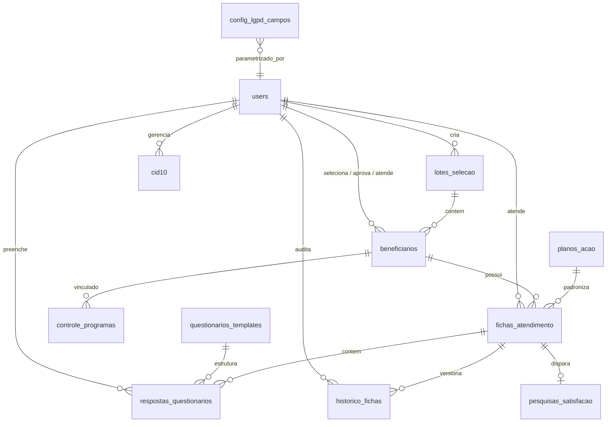

# Documento de Requisitos de Produto (PRD)

## Apoio Grupo Genki — Sistema de Acompanhamento de Saúde

> **Status do Documento:** Aprovado / Versão Oficial  
> **Versão do Documento (PRD):** v0.0.5  
> **Versão do Sistema / Software:** v0.0.31  
> **Data da Última Atualização:** Outubro de 2026  
> **Autor / Time Responsável:** Squad de Engenharia e Saúde Corporativa — Apoio Grupo Genki  
> **Público-Alvo:** Super Usuários (Administradores), Gestores Gerais Venart, Médicos Gestores de Programa, Gestores de RH Corporativo, Operação Assistencial (Atendentes/Enfermeiros) e Equipe de Engenharia / Produto

---

## 1. Visão Geral

### 1.1 Descrição do Produto

A **Plataforma Apoio Saúde** (marca: **"Apoio Grupo Genki"**) é uma solução corporativa integrada de governança clínica, triagem preditiva, gestão de sinistralidade e concierge de acompanhamento proativo e contínuo da saúde de beneficiários titulares e dependentes vinculados a planos de saúde corporativos.

O sistema orquestra ponta a ponta o ciclo de cuidado em saúde populacional:

1. **Mineração e Ingestão de Dados:** Carga de sinistralidade acumulada de 12 meses e elegibilidade processada externamente pelo time de Business Intelligence (BI) através de planilha `.xlsx` padronizada ou arquivo `.csv`;
2. **Catálogo Oficial CID-10:** Módulo dedicado (`/gestor/cid10`) para carga, sincronização via Upsert client-side e busca em tempo real da tabela CID-10 da OMS, alimentando com consistência todas as condições clínicas do ecossistema;
3. **Triagem Populacional:** O **Gestor Venart** importa lotes estruturados e seleciona beneficiários prioritários com base em critérios de corte de custo assistencial, classificação de risco e diagnósticos de base;
4. **Auditoria & Aprovação Clínica:** O **Gestor do Programa** (médico) audita e valida tecnicamente as vidas indicadas, promovendo-as para as linhas de cuidado especializadas;
5. **Distribuição Operacional Balanceada:** O **Gestor de RH** distribui as vidas aprovadas para a equipe assistencial sem viés discriminatório, respeitando regiões geográficas e capacidade de atendimento dos operadores;
6. **Cuidado Proativo & Questionários Clínicos Estruturados:** A equipe de **Operação** realiza contatos ativos (WhatsApp/telefone), aplica questionários clínicos dinâmicos parametrizados por patologia, vincula planos de ação padronizados, registra evoluções com histórico e trilha de auditoria e concede alta clínica;
7. **Desfecho & Satisfação (NPS):** Disparo de pesquisas de satisfação sem exigência de login para os beneficiários atendidos e consolidação em tempo real de KPIs de resolutividade, sinistralidade evitada, absenteísmo e produtividade assistencial.

### 1.2 Problema que Resolve

- **Sinistralidade Médica Descontrolada e Reativa:** Empresas contratantes sofrem anualmente reajustes severos nos prêmios de planos de saúde pela ausência de gestão ativa de portadores de doenças crônicas ou eventos de alto custo.
- **Vulnerabilidade Regulatória e LGPD Dinâmica:** A necessidade de equilibrar a privacidade dos colaboradores (Lei Geral de Proteção de Dados nº 13.709/2018 - LGPD) com a necessidade operacional da equipe de saúde. No modelo do Apoio Grupo Genki, **o ÚNICO campo protegido para todos os perfis é o NOME do beneficiário** (mascarado como `Beneficiário Protegido (MAT-XXXXXX)`), enquanto dados operacionais e epidemiológicos (`condicao_principal`, `risco` e `custo_12m`) permanecem visíveis para todos os perfis para viabilizar o direcionamento assistencial correto, com matriz dinâmica parametrizável via coleção `config_lgpd_campos`.
- **Falta de Padronização na Abordagem Clínica:** Acompanhamentos médicos historicamente dispersos e subjetivos. O sistema introduz **Templates de Questionários Clínicos Parametrizáveis** com governança exclusiva do Gestor Venart (`GESTOR_VENART`), garantindo protocolos homogêneos para cada condição clínica.
- **Inconsistência Cadastral e Telefônica:** Falhas de contato por telefones incompletos ou formatos heterogêneos. O sistema estabelece validação estrita e máscara de 11 dígitos `(99) 9999-99999` para telefone e celular em cadastros manuais e na importação em lote.
- **Fragmentação de Diagnósticos:** Padronização médica garantida através do Catálogo Oficial CID-10 integrado em combobox com busca indexada no PocketBase.

### 1.3 Objetivo Principal

Prover um ecossistema digital corporativo auditável, seguro e em estrita conformidade com a LGPD, que permita estratificar ativamente a população segurada, protocolar o acompanhamento com questionários clínicos especializados, estabilizar pacientes crônicos, reduzir custos assistenciais evitáveis e mensurar a resolutividade operacional com elevado índice de satisfação do paciente.

### 1.4 Identidade Visual Grupo Genki

A identidade visual do aplicativo segue rigorosamente as diretrizes da marca corporativa **Grupo Genki** ([grupogenki.com.br](https://grupogenki.com.br/)):

- **Cor Primária (Primary):** Azul-petróleo profundo `#163A4D` (fundos institucionais, cabeçalhos, botões principais e elementos de alta ênfase);
- **Cor de Acento (Accent):** Dourado / Âmbar `#D4A359` (barra de destaque abaixo do logotipo, badges de atenção, destaques interativos e estados ativos);
- **Logotipo Institucional:** Componente `GenkiLogo` apresentando a tipografia em caixa alta **GRUPO GENKI** em peso 800 com barra dourada horizontal calibrada logo abaixo; componente complementar compacto `GenkiIcon` com monograma "G" em moldura arredondada;
- **Temas:** Suporte total a temas Claro (`LIGHT`) e Escuro (`DARK`), com persistência do atributo `tema_preferido` por usuário no banco de dados e alternância instantânea no cabeçalho e menu lateral.

---

## 2. Matriz de Perfis de Acesso (RBAC) e Governança

A arquitetura de controle de acesso baseada em papéis (Role-Based Access Control — RBAC) possui 5 perfis oficiais e estritamente segregados:

| Perfil RBAC               | Código do Perfil  | Escopo de Atuação                           | Permissões e Atribuições Principais                                                                                                                                                                                                                                                                                                                                          |
| :------------------------ | :---------------- | :------------------------------------------ | :--------------------------------------------------------------------------------------------------------------------------------------------------------------------------------------------------------------------------------------------------------------------------------------------------------------------------------------------------------------------------- |
| **0. Super Usuário**      | `SUPERUSUARIO`    | Administração Global de Acessos & Logins    | **Exclusividade absoluta na criação, edição de logins/e-mails, redefinição de senhas sem exigência de senha antiga e ativação/desativação de contas de usuários** no aplicativo (`/gestor/usuarios`). Possui acesso de supervisão e auditoria global a todos os módulos administrativos. Mantém a visibilidade de e-mail (`emailVisibility = true`) garantida no PocketBase. |
| **1. Gestor Venart**      | `GESTOR_VENART`   | Governança Geral e Gestão Clínica           | Importação de lotes de sinistralidade (`.xlsx`/`.csv`), seleção populacional, **gestão e parametrização EXCLUSIVA de questionários clínicos (CRUD de templates por condição principal)**, catálogo de planos de ação, controle de programas, relatórios de auditoria clínica e visão global de ROI. _(Não tem acesso à tela de usuários, garantindo segregação total)_.      |
| **2. Gestor do Programa** | `GESTOR_PROGRAMA` | Governança Médica e Protocolar              | Análise clínica das vidas selecionadas, **aprovação de vidas para os programas (`APROVADO`)**, visualização do catálogo de planos, controle de programas e relatórios comparativos médicos.                                                                                                                                                                                  |
| **3. Gestor de RH**       | `GESTOR_RH`       | Gestão Demográfica e Logística de Vidas     | Visualização das vidas no status `APROVADO`, **distribuição balanceada para a equipe de Operação** por unidade/região e carga de trabalho, relatórios agregados de volumetria populacional.                                                                                                                                                                                  |
| **4. Operação**           | `OPERACAO`        | Execução Assistencial e Atendimento Clínico | Visualização da fila de pacientes sob sua responsabilidade, abertura e edição de Fichas de Atendimento, **preenchimento de Questionários Clínicos por patologia**, vínculo a planos de ação, registro de evoluções com histórico de auditoria, concessão de Alta Clínica e disparo de link público de satisfação (NPS).                                                      |

### 2.1 Regra Mandatória de Governança de Usuários

- **Exclusividade do Super Usuário:** Somente usuários com perfil `SUPERUSUARIO` têm permissão de acesso à rota `/gestor/usuarios`. O item de navegação correspondente não é renderizado para nenhum outro perfil.
- **Edição Flexível de Credenciais:** Ao editar um usuário na interface, o Super Usuário pode atualizar o e-mail (login) e definir uma nova senha diretamente, sem a necessidade de fornecer a senha anterior daquele colaborador. (A solicitação de senha antiga ocorre apenas na hipótese de o Super Usuário alterar sua própria senha).
- **Garantia de emailVisibility:** A migration `0020_enable_users_email_visibility.js` e a regra de coleção asseguram que os e-mails dos usuários cadastrados estejam sempre visíveis para listagem e administração na tela de gestão.

---

## 3. Política de Privacidade e LGPD Dinâmica

### 3.1 Princípio de Proteção Mínima Necessária

Em estrita observância à Lei Geral de Proteção de Dados (Lei nº 13.709/2018):

> **"De acordo com a parametrização atual da LGPD, o ÚNICO campo protegido para todos os perfis é o NOME do beneficiário. Os campos de condição clínica principal, classificação de risco e custo acumulado em 12 meses são dados estritamente operacionais e epidemiológicos, devendo permanecer visíveis para todos os perfis para assegurar o direcionamento assistencial e médico correto."**

### 3.2 Comportamento da Proteção Nominal

- Quando o campo `nome` está protegido para um perfil:
  - O nome real do paciente é mascarado dinamicamente no frontend e nas listagens pelo formato: **`Beneficiário Protegido (MAT-XXXXXX)`**, onde `MAT-XXXXXX` corresponde à matrícula funcional do titular ou dependente;
  - A matrícula original, telefone, celular, unidade e os dados epidemiológicos (`condicao_principal`, `risco`, `custo_12m`) permanecem visíveis para análise técnica e contato operacional.

### 3.3 Coleção `config_lgpd_campos`

A parametrização reside na coleção `config_lgpd_campos` do PocketBase, auditável e editável:

- `perfil`: `SUPERUSUARIO` | `GESTOR_VENART` | `GESTOR_PROGRAMA` | `GESTOR_RH` | `OPERACAO`
- `campo`: `nome` | `condicao_principal` | `risco` | `custo_12m`
- `visivel`: booleano (`true` ou `false`)
- `atualizado_por`: relação com a coleção `users`
- `atualizado_em`: data/hora da atualização

### 3.4 Matriz Padrão de Visibilidade Vigente (v0.0.31)

| Campo de Dados                 |    `SUPERUSUARIO`    |   `GESTOR_VENART`    |  `GESTOR_PROGRAMA`   |     `GESTOR_RH`      |      `OPERACAO`      | Formato Exibido                        |
| :----------------------------- | :------------------: | :------------------: | :------------------: | :------------------: | :------------------: | :------------------------------------- |
| **Matrícula Funcional**        |       Visível        |       Visível        |       Visível        |       Visível        |       Visível        | Formato original (`MAT-XXXXXX`)        |
| **Nome do Beneficiário**       | **Protegido (LGPD)** | **Protegido (LGPD)** | **Protegido (LGPD)** | **Protegido (LGPD)** | **Protegido (LGPD)** | `Beneficiário Protegido (MAT-XXXXXX)`  |
| **Condição Clínica Principal** |       Visível        |       Visível        |       Visível        |       Visível        |       Visível        | Diagnóstico CID-10 real                |
| **Classificação de Risco**     |       Visível        |       Visível        |       Visível        |       Visível        |       Visível        | `BAIXO`, `MEDIO`, `ALTO`, `CRITICO`    |
| **Custo Assistencial 12m**     |       Visível        |       Visível        |       Visível        |       Visível        |       Visível        | Valor numérico formatado em BRL (`R$`) |
| **Unidade / Região**           |       Visível        |       Visível        |       Visível        |       Visível        |       Visível        | Texto da unidade corporativa/fabril    |
| **Telefone e Celular**         |       Visível        |       Visível        |       Visível        |       Visível        |       Visível        | Máscara `(99) 9999-99999` (11 dígitos) |

---

## 4. Padronização Cadastral e Validações Estritas

### 4.1 Faixas Etárias Padronizadas (Códigos 01 a 10)

O sistema adota uma escala única de faixas etárias dividida em 10 intervalos canônicos, implementada no módulo `faixasEtarias.ts`:

| Código (ID) | Rótulo Oficial (Label) | Descrição do Intervalo                             |
| :---------: | :--------------------- | :------------------------------------------------- |
|  **`01`**   | `0 a 18 anos`          | População pediátrica e dependentes jovens          |
|  **`02`**   | `19 a 23 anos`         | Jovens adultos / início de vida profissional       |
|  **`03`**   | `24 a 28 anos`         | Adultos jovens                                     |
|  **`04`**   | `29 a 33 anos`         | Adultos                                            |
|  **`05`**   | `34 a 38 anos`         | Adultos (faixa padrão do sistema — `FAIXA_PADRAO`) |
|  **`06`**   | `39 a 43 anos`         | Adultos intermediários                             |
|  **`07`**   | `44 a 48 anos`         | Meia-idade inicial                                 |
|  **`08`**   | `49 a 53 anos`         | Meia-idade consolidada                             |
|  **`09`**   | `54 a 58 anos`         | Pré-senescência                                    |
|  **`10`**   | `59 anos ou mais`      | Idosos / população sênior                          |

- **Compatibilidade e Normalização:** Funções `getFaixaLabel` e `normalizeFaixaId` garantem a conversão automática de formatos legados (como `"18-24"`, `"35-39"`, `"60+"`) para a nomenclatura oficial.

### 4.2 Telefones Obrigatórios com Máscara de 11 Dígitos

- **Padrão Exigido:** Formato estrito **`(99) 9999-99999`** composto exatamente por 11 dígitos numéricos (DDD de 2 dígitos + número celular de 9 dígitos).
- **Validação:** Módulo `phoneMask.ts` implementa as funções `formatPhone`, `isValidPhone11` e `validatePhoneField`, aplicadas tanto no preenchimento manual de formulários quanto na rotina de validação e importação de planilhas.

### 4.3 Catálogo CID-10 e Combobox de Condição Principal

- **Coleção `cid10`:** Armazena códigos oficiais da Classificação Internacional de Doenças (código, descrição, capítulo, grupo, categoria, subcategoria e status ativo).
- **Módulo de Gestão (`/gestor/cid10`):** Permite upload de planilhas `.xlsx` ou `.csv` contendo tabelas CID-10, parser client-side com mapeamento interativo de colunas, barra de progresso visual, processamento em modo Upsert em lotes controlados e relatório detalhado de inseridos, atualizados e linhas com erro.
- **Componente `CidCombobox`:** Fornece busca assíncrona por código ou texto com debounce de 250ms, paginação integrada e ordenação alfanumérica, utilizado em todas as telas onde a condição clínica do paciente é informada ou editada.

---

## 5. Máquina de Estados dos Beneficiários

A evolução das vidas segue um fluxo determinístico e auditável em 5 estados:

```
[ELEGIVEL] ──(1) Selecionar──> [SELECIONADO] ──(2) Aprovar──> [APROVADO] ──(3) Conceder Alta──> [ATENDIDO]
    │                                                                                                  ▲
    └──────────────────────(Em caso de inativação lógica) ──> [INATIVO] <─────────────────────────────┘
```

1. **`ELEGIVEL`:** Beneficiário recém-carregado no sistema via importação de planilha (`.xlsx`/`.csv`) ou cadastro manual avulso. Permanece na base geral aguardando triagem.
2. **`SELECIONADO`:** O **Gestor Venart** aplicou filtros de risco clínico e custo acumulado na tela de seleção (`/gestor/selecionar`) e marcou a vida como prioridade para ingresso nos programas.
3. **`APROVADO`:** O **Gestor do Programa** (médico) auditou a pertinência clínica e confirmou o ingresso da vida no programa de acompanhamento. Vidas neste status são habilitadas para distribuição pelo RH e atendimento pela Operação.
4. **`ATENDIDO`:** O profissional de **Operação** concluiu o plano de cuidado, preencheu os questionários clínicos, acompanhou as evoluções e concedeu a **Alta Clínica**, disparando o link público da pesquisa de satisfação (NPS).
5. **`INATIVO`:** Beneficiário desativado logicamente através de _soft delete_ (`ativo = false`), garantindo a preservação total do histórico clínico e de sinistralidade.

---

## 6. Gestão de Questionários Clínicos (Exclusivo GESTOR_VENART)

### 6.1 Propósito e Governança

A parametrização de protocolos clínicos é prerrogativa **exclusiva do Gestor Venart** (`GESTOR_VENART`), gerenciada na rota `/gestor/questionarios`. Usuários com outros perfis não visualizam o botão de edição nem têm permissão de acesso ao módulo.

### 6.2 Estrutura dos Templates de Questionários

Cada template clínico está associado a uma condição principal e possui:

- `condicao_principal`: Diagnóstico ou condição médica vinculada (ex: _Diabetes Mellitus_, _Hipertensão Arterial_);
- `titulo` e `descricao`: Título amigável e diretrizes de preenchimento para a equipe assistencial;
- `questoes`: Array JSON estruturado contendo a lista de perguntas parametrizadas.

### 6.3 Tipos de Questões Suportadas

1. **`texto_livre`:** Campo descritivo para respostas abertas, valores laboratoriais ou datas (com placeholder informativo configurável);
2. **`escala`:** Escala numérica graduada de 0 a 5 com legendas configuráveis para os limites inferior e superior (ex.: `0 = Muito Ruim` a `5 = Excelente`);
3. **`sim_nao`:** Escolha dicotômica objetiva ("Sim" / "Não");
4. **`multipla_escolha`:** Lista com duas ou mais opções pré-definidas para seleção única pelo operador.

### 6.4 Funcionalidades do Módulo de Questionários

- **Obrigatoriedade:** Cada questão conta com o indicador `obrigatoria` para orientar o preenchimento rigoroso pelo atendente;
- **Reordenação Dinâmica:** Botões para mover perguntas para cima e para baixo dentro do protocolo;
- **Duplicação de Protocolos:** Permite clonar qualquer template existente para acelerar a criação de protocolos derivados;
- **Exclusão Inteligente (Soft Delete Protetivo):**
  - Se o template **não possuir** respostas salvas em fichas, realiza a exclusão física do registro;
  - Se o template **já possuir** respostas registradas no histórico de atendimentos, o sistema executa automaticamente **Soft Delete (`ativo = false`)**, preservando a integridade referencial dos prontuários.

### 6.5 Preenchimento e Auditoria pela Operação

- Ao abrir uma ficha de atendimento (`/atendente/fichas/:id`), a aba "Questionário Clínico" localiza o template correspondente à patologia do beneficiário;
- O operador preenche as respostas, que são salvas na coleção `respostas_questionarios`;
- Em consultas e telas de auditoria (`/gestor/fichas`), as respostas são exibidas em **modo somente leitura**, garantindo a imutabilidade do registro assistencial.

---

## 7. Importação de Beneficiários e Planilha Modelo

### 7.1 Importador de Lotes (`/gestor/importar`)

- **Formatos Aceitos:** Planilhas Excel (`.xlsx`, `.xls`) e arquivos de texto delimitado (`.csv`);
- **Validações Automáticas:** Verificação de duplicidade de matrícula, checagem de preenchimento de campos obrigatórios, conferência da máscara de 11 dígitos para telefones e validação das faixas etárias;
- **Geração de Lote:** Os registros são agrupados na coleção `lotes_selecao`, com totalizador de vidas e somatório de sinistralidade de 12 meses.

### 7.2 Planilha Modelo Oficial (`modelo-importacao-beneficiarios.xlsx`)

Disponível para download direto na tela de importação via botão dedicado, o modelo inclui cabeçalhos padronizados e **10 registros de exemplo** completos e realistas:

1. `matricula`: Código identificador único (ex.: `MAT-000001` a `MAT-000010`);
2. `nome`: Nome completo do beneficiário;
3. `vinculo`: Vínculo com a empresa contratante (`TITULAR` ou `DEPENDENTE`);
4. `unidade`: Unidade corporativa ou fabril (ex.: `São Paulo - Matriz`, `Curitiba - Filial`);
5. `faixa_etaria`: Intervalo padronizado conforme escala 01–10 (ex.: `34 a 38 anos`, `0 a 18 anos`);
6. `telefone`: Telefone com 11 dígitos formatado (ex.: `(11) 98111-2233`);
7. `celular`: Celular com 11 dígitos formatado (ex.: `(11) 98111-2233`);
8. `condicao_principal`: Diagnóstico padronizado ou código CID-10 oficial;
9. `risco`: Classificação estratificada (`BAIXO`, `MEDIO`, `ALTO`, `CRITICO`);
10. `custo_12m`: Custo assistencial acumulado nos últimos 12 meses em reais;
11. `email`: Endereço de e-mail institucional ou de contato.

---

## 8. Modelo de Dados Atualizado (PocketBase Schema)

O banco de dados PocketBase é composto pelas seguintes coleções principais:



### 8.1 Especificação das Coleções

1. **`users` (Coleção Auth do PocketBase):**
   - Campos: `name` (text), `email` (email/login), `perfil` (select: `SUPERUSUARIO`, `GESTOR_VENART`, `GESTOR_PROGRAMA`, `GESTOR_RH`, `OPERACAO`), `tema_preferido` (select: `LIGHT`, `DARK`), `categoria_profissional` (select: `ENFERMEIRO`, `MEDICO`, `ADMINISTRATIVO`), `tipo_profissional` (select: `ENFERMEIRO`, `MEDICO`), `registro_profissional` (text — CRM/COREN), `unidade_regiao` (text), `ativo` (bool), `emailVisibility` (bool — habilitado).
2. **`cid10` (Catálogo Oficial de Doenças):**
   - Campos: `codigo` (text, índice único), `descricao` (text), `capitulo` (text), `grupo` (text), `categoria` (text), `subcategoria` (text), `ativo` (bool).
3. **`config_lgpd_campos` (Matriz Dinâmica de Privacidade):**
   - Campos: `perfil` (select: `SUPERUSUARIO`, `GESTOR_VENART`, `GESTOR_PROGRAMA`, `GESTOR_RH`, `OPERACAO`), `campo` (select: `nome`, `condicao_principal`, `risco`, `custo_12m`), `visivel` (bool), `atualizado_por` (relation `users`), `atualizado_em` (date).
4. **`questionarios_templates` (Modelos de Protocolos Clínicos):**
   - Campos: `condicao_principal` (text), `titulo` (text), `descricao` (text), `ativo` (bool), `questoes` (json: array com `id`, `enunciado`, `tipo`, `obrigatoria`, `opcoes`, `escalaMin`, `escalaMax`, `legendaMin`, `legendaMax`, `placeholder`).
5. **`respostas_questionarios` (Respostas Clínicas Vinculadas às Fichas):**
   - Campos: `ficha_id` (relation `fichas_atendimento`), `template_id` (relation `questionarios_templates`), `respostas` (json: mapa id_questao → resposta), `preenchido_por` (relation `users`), `data_preenchimento` (date).
6. **`beneficiarios` (População Segurada Acompanhada):**
   - Campos: `id_externo` (text), `matricula` (text), `nome` / `nome_beneficiario` (text), `vinculo` / `tipo_vinculo` (select: `TITULAR`, `DEPENDENTE`), `titular_id` (relation `beneficiarios`), `unidade` / `unidade_regiao` (text), `faixa_etaria` (text), `telefone` (text), `celular` (text), `email` (text), `condicao_principal` (text), `risco` (select: `BAIXO`, `MEDIO`, `ALTO`, `CRITICO`), `custo_12m` / `custo_12_meses` (number), `status` (select: `ELEGIVEL`, `SELECIONADO`, `APROVADO`, `ATENDIDO`, `INATIVO`), `lote_id` (relation `lotes_selecao`), `selecionado_por` (relation `users`), `aprovado_por` (relation `users`), `atendente_id` (relation `users`), `permite_contato_whatsapp_sms` (bool), `ativo` (bool).
7. **`lotes_selecao` (Lotes de Importação de Sinistralidade):**
   - Campos: `lote_id` (text), `codigo_lote` (text, índice único), `data_selecao` / `data_importacao` (date), `tipo_lote` (select: `NOVO_REGISTRO`, `ATUALIZACAO`), `status` / `status_processamento` (select: `IMPORTADO`, `PROCESSADO`, `ERRO`), `total_beneficiarios` / `total_registros` (number), `custo_total` (number), `criado_por` / `usuario_importador_id` (relation `users`).
8. **`planos_acao` (Catálogo de Protocolos de Intervenção):**
   - Campos: `necessidade_identificada` (text), `objetivo` (text), `acao_tomada` (text), `prazo_acao_dias` (number), `prioridade` (select: `BAIXA`, `MEDIA`, `ALTA`, `URGENTE`), `ativo` (bool).
9. **`controle_programas` (Acompanhamento em Linhas de Cuidado):**
   - Campos: `beneficiario_id` (relation `beneficiarios`), `condicao_principal` (text), `risco` (select: `BAIXO`, `MEDIO`, `ALTO`, `CRITICO`), `responsavel` (text), `data_selecao` (date), `ativo` (bool).
10. **`fichas_atendimento` (Prontuário e Evolução Clínica Contínua):**
    - Campos: `ficha_id` (text), `beneficiario_id` (relation `beneficiarios`), `atendente_id` (relation `users`), `plano_acao_id` (relation `planos_acao`), `controle_programa_id` (relation `controle_programas`), `meio_contato` (select: `LIGACAO_TELEFONICA`, `WHATSAPP`, `EMAIL`, `SMS`), `status_contato` (select: `ATENDIDO`, `OCUPADO`, `SEM_RESPOSTA`, `CONTATO_INCORRETO`), `condicao_principal` (text), `risco` (select: `BAIXO`, `MEDIO`, `ALTO`, `CRITICO`), `descricao_atendimento` (text), `data_contato` (date), `data_proximo_contato` (date), `responsavel` (text), `meta` (text), `observacoes` (text), `pendencias` (text), `status_geral` (select: `EM_ACOMPANHAMENTO`, `ALTA`, `DESISTENCIA`, `AGUARDANDO_RETORNO`, `PROXIMO_CONTATO`), `data_alta` (date), `feedback` (number 0-5), `data_envio_pesquisa` (date), `data_resposta_pesquisa` (date), `versao` (number), `ativo` (bool).
11. **`historico_fichas` (Snapshots e Trilha de Auditoria Clínica):**
    - Campos: `ficha_id` (relation `fichas_atendimento`), `dados_anteriores` (json), `campo_alterado` (text), `valor_anterior` (text), `valor_novo` (text), `alterado_por` (relation `users`).
12. **`pesquisas_satisfacao` (Avaliações Públicas de NPS Sem Login):**
    - Campos: `ficha_id` (relation `fichas_atendimento`), `token` (text, índice único), `nota` (number 0-5), `comentario` (text), `data_envio` (date), `data_resposta` (date), `canal` (select: `EMAIL`, `WHATSAPP`), `status` (select: `ENVIADO`, `RESPONDIDO`, `EXPIRADO`).
13. **`logs_auditoria` (Trilha de Auditoria Geral do Sistema):**
    - Campos: `usuario_id` (relation `users`), `acao` (text), `entidade` (text), `entidade_id` (text), `dados_sensiveis` (bool), `detalhes` (json).
14. **`dashboard_cache` / `apontamentos_rh`:**
    - Consolidações analíticas pré-computadas de métricas operacionais e indicadores executivos.

---

## 9. Contas de Demonstração e Homologação Homologadas

O ambiente conta com 6 contas oficiais pré-configuradas para validação das permissões de cada perfil:

| Nome do Usuário     | E-mail de Acesso                |    Perfil RBAC    | Tema  | Atribuição Principal no Sistema                                              |
| :------------------ | :------------------------------ | :---------------: | :---: | :--------------------------------------------------------------------------- |
| **Super Usuário**   | `superusuario@venart.com.br`    |  `SUPERUSUARIO`   | LIGHT | **Administrador Global:** Exclusivo na gestão de usuários e credenciais.     |
| **Matheus Martins** | `matheus.martins@venart.com.br` |  `GESTOR_VENART`  | LIGHT | **Governança Venart:** Importação, Gestão Exclusiva de Questionários e ROI.  |
| **Larissa Alquati** | `larissa.alquati@venart.com.br` |  `GESTOR_VENART`  | DARK  | **Governança Venart (Modo Escuro):** Triagem, parametrização e auditoria.    |
| **Dr. Toshio Oba**  | `toshio.oba@venart.com.br`      | `GESTOR_PROGRAMA` | LIGHT | **Médico Gestor:** Auditoria clínica e aprovação de vidas (`APROVADO`).      |
| **Raul Mazia**      | `raul.mazia@adama.com.br`       |    `GESTOR_RH`    | LIGHT | **Gestor de RH:** Distribuição balanceada de vidas aprovadas aos atendentes. |
| **Ketlin Nazário**  | `ketlin.nazario@venart.com.br`  |    `OPERACAO`     | LIGHT | **Operação Assistencial:** Fila de cuidado, questionários clínicos e alta.   |

_Nota de Acesso para Homologação:_ A senha padrão homologada para as contas de teste é **`12345678`**.

---

## 10. Políticas de Disponibilização e Download do Documento

1. **Ausência de Botões Públicos na Interface:** Em conformidade com a solicitação do usuário na versão v0.0.14, botões ou links visíveis de download do PRD foram removidos de menus e telas do aplicativo para preservar a sobriedade e o foco operacional da interface.
2. **Disponibilização para Backup Pessoal via URL Direta:** O documento PRD oficial atualizado é mantido como asset estático acessível publicamente via requisição direta nos seguintes caminhos web:
   - **`/PRD.md`** (ou `/PRD-Apoio-Grupo-Genki-v0.0.5.md`)
   - **`/docs/PRD.md`**
3. **Formato:** Markdown puro com diagramas Mermaid nativos, tabelas de dados completas e codificação UTF-8, pronto para versionamento Git ou armazenamento em repositório de backup do cliente.
